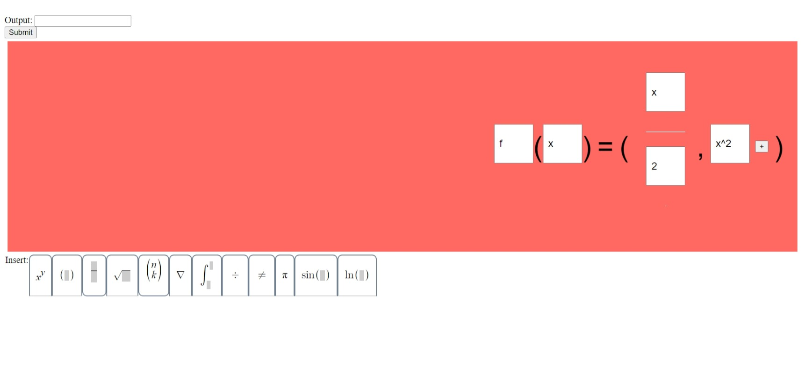

# Math Editor

To run, make sure you have Node.js installed. Then, run `node index.js`, and navigate to http://localhost:3000/. Enjoy!

Key combinations:
* CTRL + SPACE to insert/add new element
* ALT + INSERT to read current item
* CTRL + ALT + L to enter literal character insert mode (so it won't automatically insert elements for you)
* Reading/review (press any of these twice to get it into a new tab buffer):
    * CTRL + ALT + LEFT BRACKET to read aloud the whole expression using MathSpeak
        * ALT + LEFT BRACKET to read the current node in MathSpeak
    * CTRL + ALT + RIGHT BRACKET to read aloud the whole expression using the intuitive built-in readaloud system
        * ALT + RIGHT BRACKET to read the current node in Intuitive Mode
* WINDOWS + ESC to use spatial navigation

